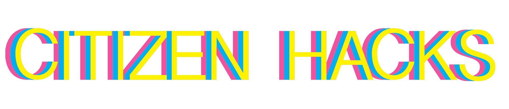

I'm a lead organizer and co-creator of [Citizen Hacks](https://citizenhacks.com/ "Citizen Hacks"), a hackathon about creating ethical technology. The central question of this year's event is "how can we build a digital future that protects everyone's privacy?" Citizen Hacks provides an opportunity for university and high school students to work with educators, businesses, nonprofits, and governmental organizations in exploring the challenges and potential of creating technology that benefits society.

To learn more about the event, visit [citizenhacks.com](https://citizenhacks.com/ "Citizen Hacks").
