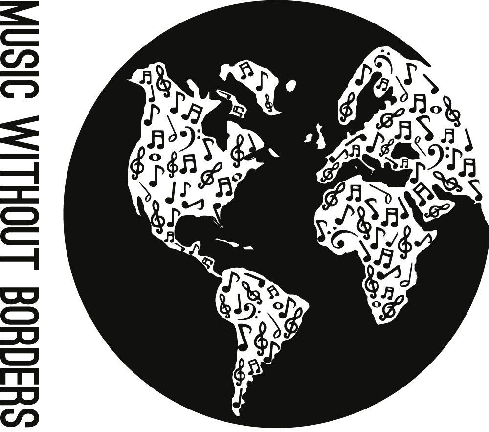

_Music Without Borders_

I co-created the [Music Without Borders](http://musicwithoutborder.com "Music Without Borders Website") fundraising campaign, which draws on the power of the arts to support the humanitarian work of [Médecins Sans Frontières / Doctors Without Borders (MSF)](http://www.msf.ca/ "MSF Website"). It's a completely student-run project that has raised more than $44,000 and engaged hundreds of youth since 2014. It continues to engage high school students from diverse interests and backgrounds across North America.  

To find out more about the story of Music Without Borders, check out [this article](http://www.doctorswithoutborders.ca/article/supporter-stories-toronto-high-school-student-explains-how-msfs-work-inspired-organizers "MWB article for MSF") that I wrote for MSF Canada.  

Visit our website at [musicwithoutborder.com](http://musicwithoutborder.com "Music Without Borders Website").  
&nbsp;  
&nbsp;  
&nbsp;  
&nbsp;  
&nbsp;  
&nbsp;  

  

&nbsp;  
&nbsp;  
&nbsp;  
&nbsp;  
&nbsp;  
&nbsp;  
