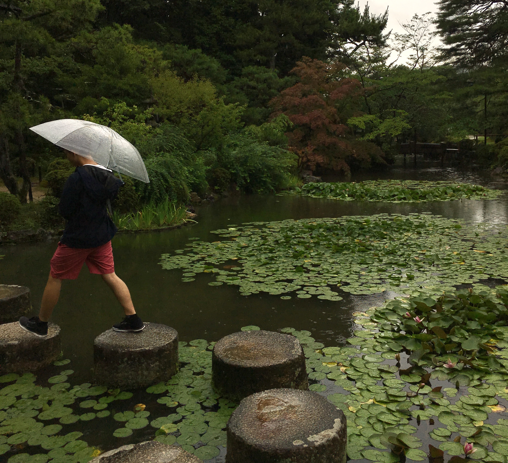

&nbsp;  
&nbsp;  
In [the interview](https://vimeo.com/212888332) that the quote is from, he discusses the concept of _ma_, a central principle in Japanese aesthetics and culture. Very generally, _ma_ is a concept of space and time being a unified idea or experience. However, the idea reveals itself more easily through examples and observation. Many natural phenomena are imbued with _ma_, such as clouds in the sky—they are constantly transforming and taking on new forms that are never complete. Or a flower blossoming, which we know will soon wilt and fade away.

Now, let's say you're sitting on the beach during golden hour. People are swimming, waves are crashing, and seagulls are calling out. Soon the sun sets, and you find yourself in the quiet dark, the moon reflecting on the calm water's surface. You've been transported from one place, with all its particular sights and sounds, to another place with its own distinct feeling. _Ma_ is a characteristic of the setting sun, and it's in the experience of moving from one space to another, and also in the relationship between those two different spaces. Here, _ma_ represents transformation, connection and division.

Japanese gardens are designed in a sequence of stages. As you follow a designated path from a miniature forest, to stepping stones across a pond covered in lilies, to a weathered temple, hidden away, your experience unfolds with each new space that you visit. In this post, each sentence is like a section of a Japanese garden. As you continue to read, your understanding of _ma_ grows with every new idea (hopefully). Even my blog can be thought of as a collection of distinct spaces that you're free to explore, and in doing so, draw connections between the ideas, artwork, and music in each post. Perhaps you'll be inspired to come up with interesting new creations of your own!

_Ma_ is broad and multifaceted, taking on various meanings in different contexts. I've mentioned some examples that illustrate my point, but instead of trying to further articulate it in general terms, I've attached links to some relevant articles at the end of the post.
&nbsp;  
&nbsp;  
&nbsp;  
&nbsp;  
&nbsp;  

&nbsp;  
&nbsp;  
&nbsp;  
&nbsp;  
With the idea of _ma_ in mind, Isozaki's quote makes more sense. The silence he is referring to is full of potential, like a blank canvas about to be painted. The extravagance is in the multitude of possible paintings that could be created. In [an earlier post](https://bennmcgregor.com/blog/embodied-light), I describe how music can both transport us to different places and bring us together as a result of the emotion associated with it. It's a similar idea here. Silence is simultaneously filled with every possible sound in our minds, and with none at all.

It's like the moment right after a song ends on a playlist in shuffle play, before you know what the next one will be. Or how, after saving America, Superman [flies off into the sunrise](https://youtu.be/gbVg3vGsDx0?t=104) towards new untold-of adventures. I'm also reminded of the [ending of Sibelius' Symphony No. 5](https://youtu.be/FAFouzo3ZHQ?t=1784). The music builds up until the entire orchestra is playing at its loudest, but when the final cadence arrives, silence punctuates each chord. After reaching its peak, the only way the music can grow even louder and greater is with silence that encompasses a sound so grand it can only be heard in our minds.

To me, the musical implications of this idea are fascinating. How can you use silence to convey a broader range of emotion? How can you use it in unconventional ways to structure and proportion a piece of music?
&nbsp;  
&nbsp;  
&nbsp;  
&nbsp;  
&nbsp;  
This discussion of _ma_ just brushes the surface. I'm realizing that the concept can be applied literally everywhere. It's even informed the flow of ideas in each sentence and paragraph of this post. I'm trying to place commas, periods, m-dashes, and line breaks to leave the right about of time and space for the reader to process and react to what I've written. Throughout this process, however, one question's been bothering me—so what? How can this discussion benefit society?

I'm still thinking of answers to this question. Here's one idea: _ma_ can offer a different way of thinking about human relationships. Humanity is diverse, and building connections across our differences is a central challenge for society—it's easy to focus on how our differences might separate us. But once we recognize that these "spaces" between us are actually imbued with potential, and even beauty, endless new possibilities for connection reveal themselves. How can we harness the creative potential of diversity in our own lives?
&nbsp;  
&nbsp;  
&nbsp;  
&nbsp;  
&nbsp;  
&nbsp;  
&nbsp;  
&nbsp;  
Follow these links (in order of ascending difficulty) to learn more about _ma_:

[Ricepaper Magazine Article](https://ricepapermagazine.ca/2013/02/%E9%96%93-an-aesthetic-of-space-time/) that describes the concept in fairly straightforward terms.&nbsp;  
[New York Times Review of an exhibit on _ma_](https://www.nytimes.com/1979/03/25/archives/architecture-view-on-the-japanese-esthetic.html) curated by Isozaki. It describes some beautiful and fascinating principles related to _ma_ that help with understanding its nuances.&nbsp;  
[Kyoto Journal Article](https://kyotojournal.org/culture-arts/ma-place-space-void/) that gives examples of the concept's usage in the Japanese language, and by extension, Japanese culture.
&nbsp;  
&nbsp;  
&nbsp;  
