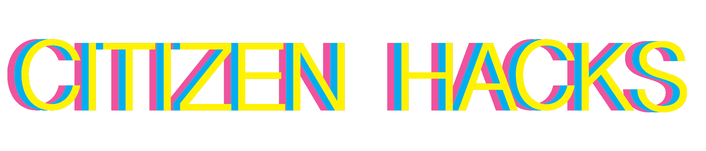

I was a lead organizer and co-creator of [Citizen Hacks](https://citizenhacks.com/ "Citizen Hacks"), a hackathon about creating ethical technology. The central question of the event was "how can we build a digital future that protects everyone's privacy?" Citizen Hacks provides an opportunity for university and high school students to work with educators, businesses, nonprofits, and governmental organizations in exploring the challenges and potential of creating technology that benefits society.

I [wrote an article about Citizen Hacks](https://web.archive.org/web/20191004173608/https://uwaterloo.ca/software-engineering/news/se-students-organize-citizen-hacks) that was featured on the University of Waterloo Daily Bulletin and the Software Engineering program website. The UW [Engineering](https://web.archive.org/web/20191004173948/https://uwaterloo.ca/engineering/news/students-take-top-prizes-first-privacy-hackathon) and [Computer Science](https://web.archive.org/web/20191004173714/https://cs.uwaterloo.ca/news/anne-chung-lena-nguyen-win-first-place-citizen-hacks) departments also published news reports on the results of the event. I also spoke about Citizen Hacks at [IAPP Canada Privacy Symposium Online 2021](https://iapp.org/conference/symposium-online/) as a panelist on "Jamming It Up! Innovative Solutions to the Online Consent Challenge". 

To learn more about the event, visit [citizenhacks.com](https://citizenhacks.com/ "Citizen Hacks"). 
