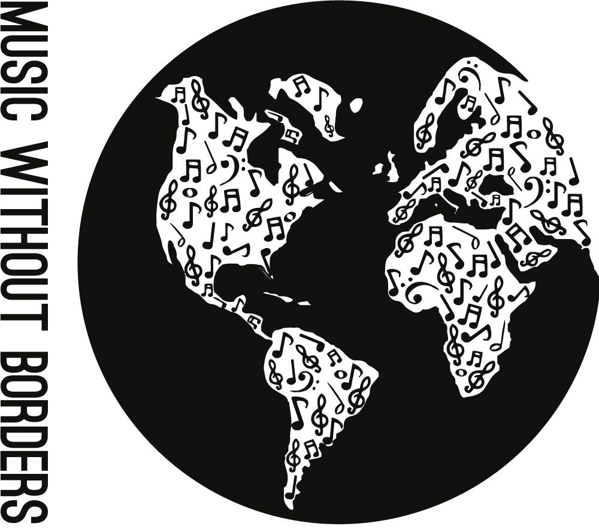

_Music Without Borders_

I co-created the [Music Without Borders](http://musicwithoutborder.com "Music Without Borders Website") fundraising campaign, which draws on the power of the arts to support the humanitarian work of [Médecins Sans Frontières / Doctors Without Borders (MSF)](http://www.msf.ca/ "MSF Website"). It's a completely student-run project that has raised more than $56,500 for MSF and engaged hundreds of youth since 2014. It continues to engage high school and university students from diverse interests and backgrounds across North America.

To find out more about the story of Music Without Borders, check out [this article](http://www.doctorswithoutborders.ca/article/supporter-stories-toronto-high-school-student-explains-how-msfs-work-inspired-organizers "MWB article for MSF") that I wrote for MSF Canada.  

In 2022, spurred to action by Russia's invasion of Ukraine, I co-organized another [Music Without Borders "Concert for Ukraine"](https://linktr.ee/musicwithoutborder) supporting the Canada-Ukraine Foundation's Ukraine Humanitarian Appeal. The event was attended by over 100 people and raised over $6,000 for the appeal, bringing the total funds raised by Music Without Borders events to more than $61,500.

Visit our website at [musicwithoutborder.com](http://musicwithoutborder.com "Music Without Borders Website") and blog at [blog.musicwithoutborder.com](http://blog.musicwithoutborder.com "Music Without Borders Blog").
&nbsp;  
&nbsp;  
&nbsp;  
&nbsp;  
&nbsp;  
&nbsp;  

  

&nbsp;  
&nbsp;  
&nbsp;  
&nbsp;  
&nbsp;  
&nbsp;  
